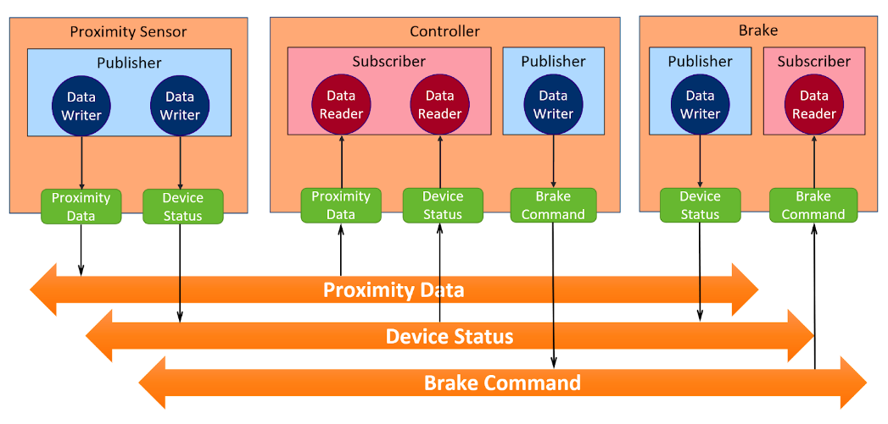

# Virtual Instructor-Led Training (VILT) Example 

This example project implements a simplified control system consisting of a proximity sensor, a controller, and a braking actuator. These components are found in the files `proximity_sensor.cxx`, `controller.cxx`, and `brake.cxx`, respectively. These applications use three Topics to communicate, as shown in the diagram below:



The generated, type-support files used were generated using `rtiddsgen` as supplied with Connext DDS Professional 6.0.1 for the `x64Linux4gcc7.3.0` architecture. All user-defined types are in the IDL file `DataTypeDefinitions.idl`. 
- The `as-generated` branch in this repo contains the example code "as generated" 
  - $NDDSHOMEbin/rtiddsgen ./DataTypeDefinitions.idl -ppDisable -language C++11 -create typefiles -create examplefiles -create makefiles -platform x64Linux4gcc7.3.0
- The current state of the `master` branch uses cmake and a custom `CMakeLists.txt` file that replaced the generated make file.

## To Build this example:
``` 
$ git clone https://github.com/dgochenour/vilt.git
$ cd vilt
$ mkdir build
$ cd build
$ cmake -DCMAKE_BUILD_TYPE=<Release|Debug> ..
$ make 
```

## To Run this Example:
1) Make sure you are in the directory where the `USER_QOS_PROFILES.xml` file was
generated (the same directory this README file is in).

2) Run the following script to make sure the Connext libraries are in the path for each shell that you open.
```
$ /path/to/your/rti_connext_dds-6.0.1/resource/scripts/rtisetenv_x64Linux4gcc7.3.0.bash
```

3) In three different shells, run the example applications typing:
```
$ ./objs/x64Linux4gcc7.3.0/proximity_sensor <domain_id> <sample_count>
$ ./objs/x64Linux4gcc7.3.0/controller <domain_id> <sample_count>
$ ./objs/x64Linux4gcc7.3.0/brake <domain_id> <sample_count>
```